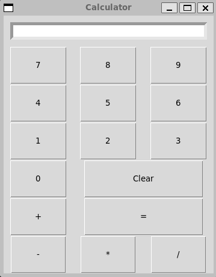

# Python Calculator

This is a pocket sized calculator GUI built with Tkinter.<br>
It mimics the look and feel of a classic handheld calculator.<br>

---



---

### Features

Four functions arithmetic&nbsp;`(+ – × ÷)`<br>
Keyboard **and** mouse input<br>
Clear 'C' and backspace support<br>
Error handling (e.g. *division by zero*)<br>

---

### Requirements 

Python ≥ 3.8
Tkinter ships with the standard interpreter on many platforms

---

### Quick start 

**Clone this repo:**  
```git clone git@github.com:neilburbage/Python-Calc```  
**Make sure you've added your SSH key first:**   
```https://docs.github.com/en/authentication/connecting-to-github-with-ssh```    
```cd Python-Calc```  
**Create a virtual environment:**       
```python -m venv .venv```  
```# Linux / macOS: source .venv/bin/activate```     
```# Windows (PowerShell): .venv\Scripts\Activate.ps1```  
```# Windows (cmd): .venv\Scripts\activate.bat```   
**Run the Calculator:**  
```calculator.py```  

---

### Project layout

```
Python-Calc/
|
├── calculator.py    # GUI Calculator script
├── .gitignore       # .venv/, __pycache__/
└── README.md        # you are here
```

---